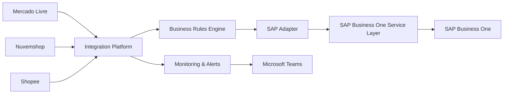
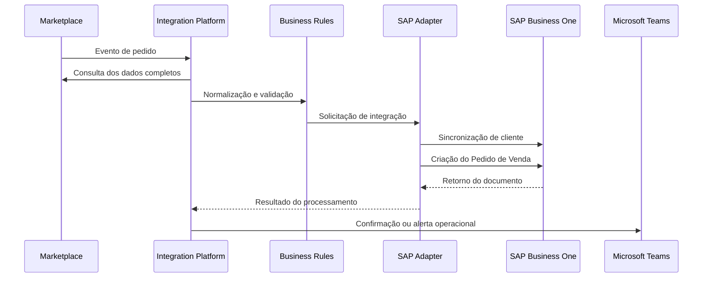
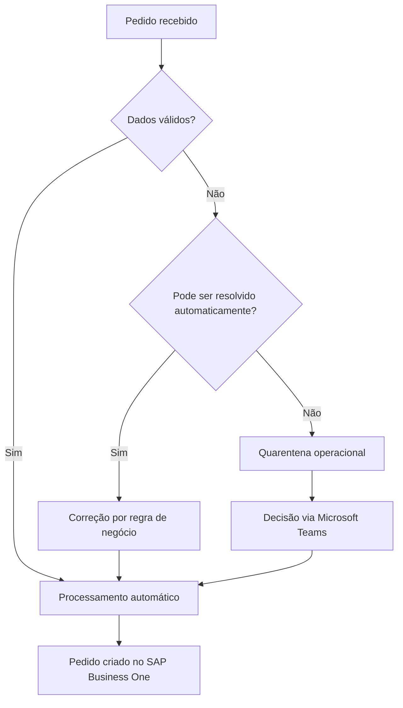

# SAP Business One Integration Platform

### Mercado Livre • Nuvemshop • Shopee → SAP Business One

Plataforma corporativa de integração multi-marketplace desenvolvida para automatizar o ciclo completo de pedidos entre **Mercado Livre**, **Nuvemshop**, **Shopee** e o **SAP Business One**.

A solução combina **Service Layer**, **n8n**, **FastAPI**, **Python**, **SQL Server** e **Microsoft Teams** para eliminar lançamentos manuais, reduzir falhas operacionais e criar uma base escalável para novos canais de venda.

  <strong>SAP Business One • Service Layer • n8n • FastAPI • Python • SQL Server • Microsoft Teams</strong>

> Este repositório apresenta uma visão pública e sanitizada da solução. Código-fonte, credenciais, endpoints, estruturas internas, dados corporativos e regras proprietárias permanecem privados.

---

## Visão geral

A plataforma recebe eventos dos marketplaces, consulta os dados completos do pedido, normaliza as informações, aplica regras de negócio, sincroniza clientes e cria automaticamente o Pedido de Venda no SAP Business One.

Também contempla tratamento de inconsistências, cancelamentos, reprocessamento seguro, prevenção de duplicidades, monitoramento operacional e decisões assistidas via Microsoft Teams.

---

## Status por canal

| Canal | Status | Escopo público |
|---|---|---|
| **Mercado Livre** | ✅ Produção estável | Pedidos, clientes, cancelamentos, kits, combos, quarentena e alertas |
| **Nuvemshop** | ✅ Produção estável | Pedidos, clientes, cancelamentos, combos e regras compartilhadas |
| **Shopee** | 🚧 Credenciamento | Conector previsto sobre a mesma arquitetura central |

---

## Principais capacidades

- Integração multi-marketplace
- Processamento orientado a eventos
- Criação automática de clientes e pedidos
- Sincronização com SAP Business One via Service Layer
- Tratamento de divergências cadastrais
- Quarentena para validação humana
- Cancelamento automático e seguro
- Idempotência em operações críticas
- Reprocessamento controlado
- Controle de concorrência
- Monitoramento operacional
- Alertas no Microsoft Teams
- Logs centralizados
- Arquitetura preparada para expansão

---

## Fluxo operacional

---

## Tratamento de exceções

Nem toda inconsistência deve interromper a operação ou exigir intervenção técnica.

A plataforma separa automaticamente os cenários que podem ser resolvidos por regra daqueles que exigem decisão humana.

Esse modelo reduz falhas silenciosas, evita bloqueios desnecessários e mantém rastreabilidade das decisões.

---

## Arquitetura da solução

A solução foi estruturada em camadas independentes para permitir manutenção, evolução e inclusão de novos canais sem duplicação das regras críticas do ERP.

| Camada | Responsabilidade |
|---|---|
| **Marketplace Connectors** | Recepção e consulta de eventos dos canais |
| **Workflow Orchestration** | Orquestração, validações e tratamento de exceções |
| **Business Rules Engine** | Regras comerciais, fiscais e operacionais |
| **SAP Adapter** | Interface segura e padronizada com o SAP Business One |
| **Persistence Layer** | Controle de estado, idempotência e rastreabilidade |
| **Monitoring Layer** | Logs, alertas e acompanhamento operacional |

---

## Tecnologias utilizadas

| Tecnologia | Aplicação |
|---|---|
| **SAP Business One** | ERP corporativo |
| **SAP Service Layer** | Integração oficial com o ERP |
| **n8n** | Orquestração dos workflows |
| **Python** | Regras, serviços e integração |
| **FastAPI** | Camada de adaptação para o SAP |
| **SQL Server** | Persistência e controle operacional |
| **Microsoft Teams** | Alertas e decisões operacionais |
| **Power Automate** | Entrega de cards e notificações |
| **Docker** | Execução e isolamento de serviços |
| **Redis** | Processamento em fila e escalabilidade |

---

## Desafios de engenharia resolvidos

### Idempotência

Marketplaces podem reenviar o mesmo evento diversas vezes. A plataforma garante que pedidos, clientes e cancelamentos não sejam processados em duplicidade.

### Concorrência

Requisições simultâneas são controladas para evitar criação duplicada de clientes, colisões de sessão e inconsistências transacionais.

### Divergências cadastrais

Quando os dados enviados pelo marketplace divergem dos dados existentes no ERP, o pedido pode ser direcionado para quarentena e validado por um responsável.

### Resiliência

Falhas temporárias não resultam em perda definitiva do pedido. Os eventos permanecem rastreáveis e podem ser reprocessados de forma segura.

### Expansão multi-canal

Os conectores dos marketplaces são independentes, enquanto as regras centrais de integração permanecem compartilhadas.

### Kits e combinações de itens

A solução trata cenários em que um anúncio representa múltiplas unidades ou diferentes itens, preservando quantidade, composição e valor total do pedido.

---

## Resultados entregues

- Redução do lançamento manual de pedidos
- Menor risco de duplicidade
- Padronização do cadastro de clientes
- Centralização das regras de integração
- Maior velocidade no processamento
- Rastreabilidade ponta a ponta
- Tratamento estruturado de exceções
- Operação monitorada em tempo real
- Base preparada para novos canais de venda

---

## Marketplaces integrados

### Mercado Livre

Integração completa do pedido pago ao Pedido de Venda no SAP Business One, incluindo validação cadastral, processamento de itens, cancelamento e alertas operacionais.

### Nuvemshop

Integração de pedidos e cancelamentos com o mesmo núcleo de regras do ERP, preservando as particularidades do canal.

### Shopee

Conector planejado sobre a mesma arquitetura, com implantação condicionada às etapas de credenciamento e liberação da plataforma.

---

## Segurança e privacidade

Este repositório não contém:

- Credenciais ou tokens
- URLs privadas e endpoints internos
- Dados de clientes ou dados corporativos
- Nomes de servidores e ambientes
- Estruturas proprietárias de banco
- Queries internas
- Workflows exportados
- Código-fonte da operação
- Regras fiscais ou comerciais confidenciais

A documentação pública apresenta apenas a arquitetura conceitual, as tecnologias utilizadas, os problemas resolvidos e os resultados do projeto.

---

## Roadmap

- [x] Fundação da arquitetura
- [x] Adapter de integração com SAP Business One
- [x] Camada de persistência e idempotência
- [x] Integração Mercado Livre
- [x] Quarentena operacional
- [x] Alertas e decisões via Microsoft Teams
- [x] Integração Nuvemshop
- [x] Cancelamento automatizado
- [x] Painel consolidado de observabilidade
- [ ] Integração Shopee
- [ ] Métricas operacionais e indicadores de SLA
---

## Próximas evoluções

- Dashboard central de integrações
- Indicadores de sucesso e falha por canal
- Tempo médio de processamento
- Gestão visual de reprocessamentos
- Novos conectores de marketplace
- Camada de configuração por empresa
- Evolução para arquitetura multi-tenant

---

## Sobre o projeto

Este projeto foi desenvolvido como uma plataforma corporativa de integração, e não como um script isolado.

A arquitetura combina automação de processos, integração de sistemas, regras de negócio, observabilidade e operação assistida, conectando **Mercado Livre**, **Nuvemshop** e **Shopee** ao **SAP Business One**.

O case demonstra experiência prática em:

- Integração de ERP
- SAP Business One
- Service Layer
- APIs REST
- Automação com n8n
- Python e FastAPI
- SQL Server
- Arquitetura orientada a eventos
- Integrações corporativas
- Monitoramento operacional
- Resiliência e idempotência

---

## Autor

**Rodrigo Mota de Oliveira**

Business Systems • Automação Corporativa • Integração de Sistemas • SAP Business One • n8n • APIs • SQL • Power BI

---

## Aviso

SAP, SAP Business One e demais marcas citadas pertencem aos seus respectivos proprietários.

Este repositório é um case técnico independente e não representa documentação oficial dos marketplaces ou da SAP.
