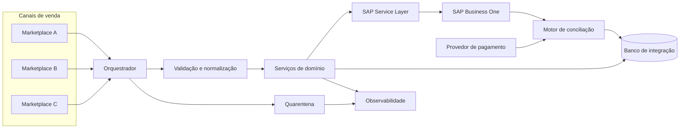

# SAP Commerce Integration Platform

> Plataforma de integração ponta a ponta entre marketplaces e SAP Business One, da captura do pedido à automação financeira, com conciliação como próxima fase arquitetural.

<p align="center">
  
</p>

**Status:** Fase 1 em produção · Fase 2 entregue e em rollout produtivo · Fase 3 em desenvolvimento  
**Autor:** Rodrigo Mota de Oliveira  
**Stack:** SAP Business One Service Layer · n8n · SQL Server · Python/FastAPI · Docker · Microsoft Teams

> Este repositório apresenta uma versão pública e sanitizada de uma plataforma real. Credenciais, endpoints, dados corporativos, nomes internos e regras proprietárias foram removidos ou substituídos por exemplos fictícios.

## O problema

Em operações de e-commerce, o pedido nasce no canal de venda, mas o ERP precisa receber dados consistentes de cliente, itens, entrega e pagamento. Depois, o financeiro ainda precisa registrar os documentos correspondentes e reconciliar o valor efetivamente liquidado pelos marketplaces e provedores de pagamento.

Sem uma camada de integração, esse ciclo depende de digitação, planilhas, conferências manuais e correções tardias.

## A solução

A plataforma foi estruturada como um produto evolutivo, e não como um workflow isolado:

```text
Marketplace
  → ingestão e normalização
  → validações e regras de negócio
  → parceiro de negócios no SAP
  → pedido de venda
  → adiantamento
  → recebimento e referência financeira
  → conciliação por API ou arquivo
  → exceções, auditoria e reprocessamento
```

### Fase 1: Integração comercial

**Status: produção**

- Captura de pedidos por webhook e polling.
- Normalização para um modelo canônico.
- Validação de cliente, endereço, itens e entrega.
- Criação ou resolução do Business Partner.
- Criação automática do Pedido de Venda no SAP Business One.
- Tratamento de kits, combos, cancelamentos e inconsistências cadastrais.
- Idempotência, logs, quarentena e reprocessamento.

### Fase 2: Integração financeira

**Status: entregue e em rollout produtivo**

- Resolução e mapeamento dos meios de pagamento.
- Criação de adiantamento vinculado ao pedido.
- Criação de recebimento.
- Registro de cartão ou referência de transação.
- Testes de retomada e idempotência.
- Feature flag para ativação controlada.
- Monitoramento das primeiras semanas de produção.

### Fase 3: Conciliação financeira

**Status: desenvolvimento**

- Ingestão de liquidações dos marketplaces e provedores de pagamento.
- Staging financeiro separado do fluxo transacional.
- Matching automático contra documentos esperados no ERP.
- Tratamento de taxas, descontos, pagamentos parciais e divergências.
- Alertas somente para exceções.
- Auditoria e reprocessamento seguro.

A Fase 3 não é apresentada como concluída. Sua ativação depende da estabilidade e consistência dos dados produzidos pelas fases anteriores.

## Arquitetura


```mermaid
flowchart LR
    subgraph Channels[Canais de venda]
        A[Marketplace A]
        B[Marketplace B]
        C[Marketplace C]
    end
    A --> O[Orquestrador]
    B --> O
    C --> O
    O --> V[Validação e normalização]
    V --> D[Serviços de domínio]
    D --> SL[SAP Service Layer]
    SL --> ERP[SAP Business One]
    D --> DB[(Banco de integração)]
    O --> Q[Quarentena]
    D --> M[Observabilidade]
    Q --> M
    P[Provedor de pagamento] --> R[Motor de conciliação]
    ERP --> R
    R --> DB
```

## Engineering highlights

- Processamento idempotente por chave externa.
- Correlation ID em todas as etapas.
- Retry limitado, com backoff e classificação de falhas.
- Modelo canônico para desacoplar canais e ERP.
- Quarentena para casos que exigem decisão humana.
- Feature flags por canal e fase.
- Staging financeiro fora das tabelas transacionais do ERP.
- Monitoramento orientado a exceções.
- Audit trail por pedido e documento financeiro.
- Separação entre orquestração, domínio e transporte.

## Stack

| Camada | Tecnologias |
|---|---|
| ERP | SAP Business One · Service Layer |
| Orquestração | n8n self-hosted |
| Serviços | Python · FastAPI |
| Dados | SQL Server · staging · stored procedures |
| Infraestrutura | Docker · Linux VPS · Redis |
| Observabilidade | Logs estruturados · correlation IDs · alertas |
| Operação assistida | Microsoft Teams · Adaptive Cards |

## Documentação

- [Arquitetura detalhada](./docs/architecture.md)
- [Fluxos ponta a ponta](./docs/business-flow.md)
- [Decisões arquiteturais](./docs/decisions.md)
- [Segurança e sanitização](./docs/security.md)
- [Observabilidade](./docs/observability.md)
- [Roadmap](./docs/roadmap.md)
- [Case para portfólio](./docs/portfolio-case.md)
- [Versão para LinkedIn](./docs/linkedin-project.md)

## Resultados e impacto

- Eliminação de etapas manuais na criação de pedidos.
- Redução do risco de duplicidade e inconsistência cadastral.
- Padronização da integração entre múltiplos canais e o ERP.
- Rastreabilidade de cada pedido por etapa.
- Tratamento estruturado de exceções sem bloquear todo o fluxo.
- Automação do ciclo financeiro após a criação do pedido.
- Base arquitetural pronta para conciliação financeira.

Não são apresentados valores financeiros inventados. O impacto comprovado é operacional: menor retrabalho, menor dependência de lançamento manual, maior velocidade e maior confiabilidade.

## Roadmap resumido

| Entrega | Status |
|---|---|
| Fundação e integração comercial | ✅ Produção |
| Idempotência, quarentena e reprocessamento | ✅ Produção |
| Integração financeira | ✅ Entregue / rollout |
| Conector adicional | 🟡 Dependente de credenciamento |
| Conciliação automática | 🔶 Desenvolvimento |
| Métricas de SLA e painel executivo | 🔶 Roadmap |

## Autor

**Rodrigo Mota de Oliveira**  
Dados, Business Intelligence, Integrações e Automação Corporativa

- GitHub: [@rmota13](https://github.com/rmota13)
- Portfólio: [motainteligencia.com.br](https://motainteligencia.com.br)

## Aviso

SAP, SAP Business One e as demais marcas citadas pertencem aos seus respectivos proprietários. Este repositório é um case técnico independente e não representa documentação oficial da SAP, dos marketplaces ou da empresa onde a solução original foi desenvolvida.
