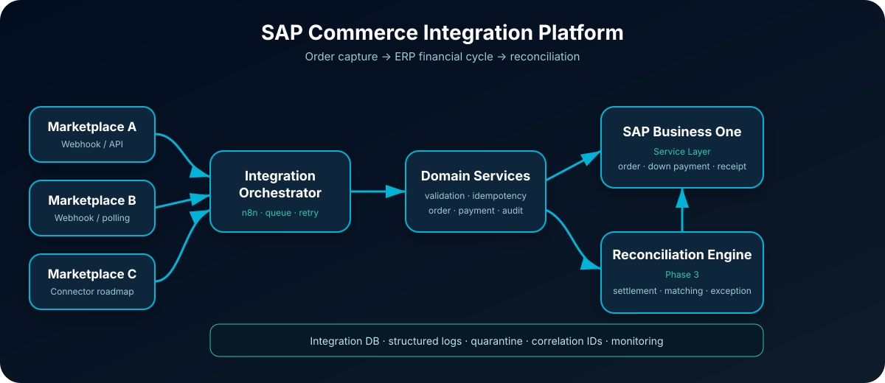
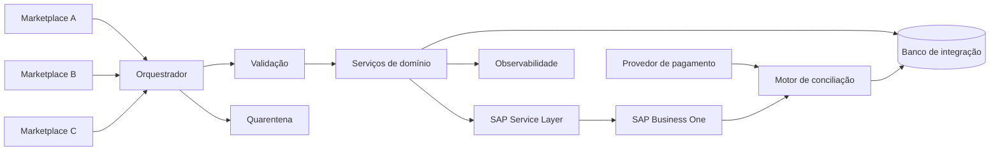

# SAP Commerce Integration Platform

> Plataforma de integração ponta a ponta entre marketplaces e SAP Business One, da captura do pedido à automação financeira, com conciliação como próxima fase arquitetural.

<p align="center"></p>

**Status:** Fase 1 em produção · Fase 2 entregue e em produção · Fase 3 em desenvolvimento  
**Autor:** Rodrigo Mota de Oliveira  
**Stack:** SAP Business One Service Layer · n8n · SQL Server · Python/FastAPI · Docker · Microsoft Teams

> Repositório público e sanitizado de uma plataforma real. Credenciais, endpoints, dados corporativos e regras proprietárias foram removidos.

## O problema

Pedidos de e-commerce precisam chegar ao ERP com cliente, itens, entrega e pagamento consistentes. Depois, o financeiro ainda precisa registrar documentos e reconciliar o valor efetivamente liquidado por marketplaces e provedores. Sem uma camada de integração, esse ciclo depende de digitação, planilhas e conferências manuais.

## A solução

```text
Marketplace → normalização → validações → Business Partner → pedido de venda
→ adiantamento → recebimento → referência financeira → conciliação → exceções e auditoria
```

### Fase 1: Integração comercial

**Produção**

- Captura por webhook e polling.
- Modelo canônico de pedidos.
- Validação de cliente, endereço, itens e entrega.
- Criação ou resolução do Business Partner.
- Criação automática do Pedido de Venda.
- Kits, combos, cancelamentos e inconsistências cadastrais.
- Idempotência, logs, quarentena e reprocessamento.

### Fase 2: Integração financeira

**Entregue e em rollout produtivo**

- Mapeamento dos meios de pagamento.
- Criação de adiantamento.
- Criação de recebimento.
- Registro de cartão ou referência de transação.
- Testes de retomada e idempotência.
- Feature flag e monitoramento controlado.

### Fase 3: Conciliação financeira

**Desenvolvimento**

- Ingestão de liquidações por API ou arquivo.
- Staging financeiro.
- Matching automático contra o ERP.
- Taxas, descontos, pagamentos parciais e divergências.
- Alertas apenas para exceções.
- Auditoria e reprocessamento seguro.

## Arquitetura


```mermaid
flowchart LR
    A[Marketplace A] --> O[Orquestrador]
    B[Marketplace B] --> O
    C[Marketplace C] --> O
    O --> V[Validação]
    V --> D[Serviços de domínio]
    D --> SL[SAP Service Layer]
    SL --> ERP[SAP Business One]
    D --> DB[(Banco de integração)]
    O --> Q[Quarentena]
    D --> M[Observabilidade]
    P[Provedor de pagamento] --> R[Motor de conciliação]
    ERP --> R
    R --> DB
```

## Engineering highlights

- Idempotência por chave externa.
- Correlation ID ponta a ponta.
- Retry limitado com backoff.
- Modelo canônico desacoplado do ERP.
- Quarentena para decisão humana.
- Feature flags por canal e fase.
- Staging financeiro separado.
- Monitoramento orientado a exceções.
- Audit trail por pedido e documento financeiro.

## Stack

| Camada | Tecnologias |
|---|---|
| ERP | SAP Business One · Service Layer |
| Orquestração | n8n self-hosted |
| Serviços | Python · FastAPI |
| Dados | SQL Server · staging · stored procedures |
| Infraestrutura | Docker · Linux VPS · Redis |
| Operação | Microsoft Teams · Adaptive Cards |

## Documentação

- [Arquitetura](./docs/architecture.md)
- [Fluxos](./docs/business-flow.md)
- [Decisões arquiteturais](./docs/decisions.md)
- [Segurança](./docs/security.md)
- [Observabilidade](./docs/observability.md)
- [Roadmap](./docs/roadmap.md)
- [Case de portfólio](./docs/portfolio-case.md)
- [Versões para LinkedIn](./docs/linkedin-project.md)

## Impacto

- Eliminação de etapas manuais.
- Menor risco de duplicidade e inconsistência cadastral.
- Integração padronizada entre canais e ERP.
- Rastreabilidade por etapa.
- Exceções tratadas sem bloquear todo o fluxo.
- Automação do ciclo financeiro.
- Base preparada para conciliação.

## Autor

**Rodrigo Mota de Oliveira**  
Dados, Business Intelligence, Integrações e Automação Corporativa

- GitHub: [@rmota13](https://github.com/rmota13)
- Portfólio: [motainteligencia.com.br](https://motainteligencia.com.br)

## Aviso

Este é um case técnico independente e não representa documentação oficial da SAP, dos marketplaces ou da empresa onde a solução original foi desenvolvida.
