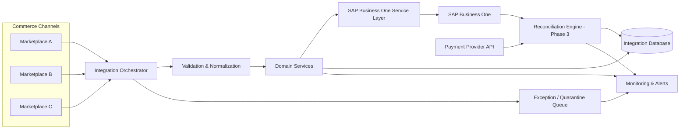
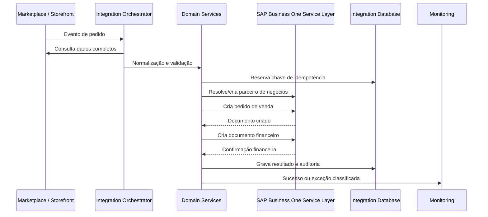
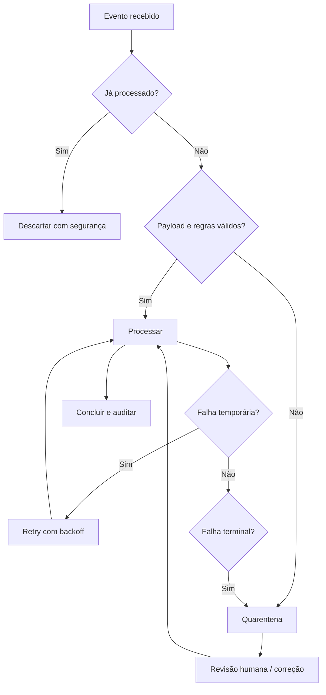

# SAP Commerce Integration Platform

> Plataforma de integração ponta a ponta entre marketplaces e SAP Business One — da captura do pedido à automação financeira, com conciliação como próxima fase arquitetural.

[](https://www.sap.com/products/erp/business-one.html)
[](https://n8n.io)
[](https://www.microsoft.com/sql-server)
[](https://www.typescriptlang.org)
[](https://www.docker.com)
[](./LICENSE)

**Status:** Fase 1 em produção · Fase 2 em implantação final · Fase 3 em design/desenvolvimento  
**Autor:** Rodrigo Mota de Oliveira — Dados, Integrações e Automação Corporativa  
**Stack de referência:** n8n, SAP Business One Service Layer, SQL Server, TypeScript/Node.js e Docker

> Este repositório é uma representação pública e sanitizada de uma plataforma real. Credenciais, endpoints, dados corporativos, estruturas internas e regras proprietárias foram removidos ou substituídos por exemplos fictícios.

---

## Visão geral

Empresas que vendem por múltiplos canais digitais enfrentam um problema recorrente: o pedido nasce no marketplace, mas o ERP não possui uma integração nativa e confiável para absorver o pedido, registrar o ciclo financeiro e, posteriormente, reconciliar o valor efetivamente liquidado.

Esta plataforma foi criada para fechar essa lacuna operacional. Ela recebe eventos dos canais, normaliza dados, aplica regras de negócio, resolve clientes e meios de pagamento, integra documentos no SAP Business One e mantém rastreabilidade, idempotência, quarentena e reprocessamento controlado.

Não é um script de sincronização. É uma plataforma evolutiva organizada em três fases.

## Arquitetura geral


```mermaid
flowchart LR
    subgraph Channels[Commerce Channels]
        A[Marketplace A]
        B[Marketplace B]
        C[Marketplace C]
    end

    A --> O[Integration Orchestrator]
    B --> O
    C --> O

    O --> V[Validation & Normalization]
    V --> D[Domain Services]
    D --> S[SAP Business One Service Layer]
    S --> ERP[SAP Business One]

    D --> DB[(Integration Database)]
    O --> Q[Exception / Quarantine Queue]
    D --> M[Monitoring & Alerts]
    Q --> M

    P[Payment Provider API] --> R[Reconciliation Engine - Phase 3]
    ERP --> R
    R --> DB
    R --> M
```

## Fases da plataforma

### Fase 1 — Integração comercial

**Status: produção**

- Captura de pedidos por webhook e polling.
- Normalização para um modelo canônico.
- Validação de cliente, endereço, itens, frete e referências externas.
- Criação ou atualização do parceiro de negócios.
- Criação automática do Pedido de Venda no SAP Business One.
- Tratamento de kits, combos, cancelamentos e exceções cadastrais.
- Logs, idempotência, quarentena e reprocessamento.

### Fase 2 — Integração financeira

**Status: implantação final**

- Resolução e mapeamento dos meios de pagamento.
- Criação de adiantamento vinculado ao pedido.
- Criação de recebimento e referência financeira.
- Registro de transação/cartão quando aplicável.
- Retry controlado, feature flags e monitoramento por etapa.
- Validação financeira ponta a ponta antes do go-live completo.

### Fase 3 — Conciliação financeira

**Status: design/desenvolvimento**

- Ingestão de liquidações de marketplaces e provedores de pagamento.
- Staging financeiro desacoplado do fluxo transacional.
- Matching automático entre liquidação e títulos esperados no ERP.
- Tratamento de taxas, descontos, divergências e pagamentos parciais.
- Alertas apenas para exceções.
- Auditoria e reprocessamento seguro.

> A Fase 3 não é apresentada como concluída. A arquitetura está definida, mas sua ativação depende da estabilidade e consistência dos dados gerados pelas fases anteriores.

## Engineering highlights

- **Idempotent processing** por chave externa.
- **Retry com backoff** e classificação de falhas terminais.
- **Correlation ID** para rastreabilidade ponta a ponta.
- **Canonical order model** para desacoplar canais e ERP.
- **Quarantine queue** para inconsistências que exigem decisão humana.
- **Feature flags** por canal e por etapa de rollout.
- **Financial staging** separado do banco transacional do ERP.
- **Exception-first monitoring**: sucesso é silencioso; divergência gera alerta.
- **Audit trail** por etapa e por documento.
- **Separation of concerns** entre orquestração, domínio e integração.

## Fluxo ponta a ponta


```mermaid
sequenceDiagram
    participant Channel as Marketplace / Storefront
    participant Orchestrator as Integration Orchestrator
    participant Domain as Domain Services
    participant SAP as SAP Business One Service Layer
    participant DB as Integration Database
    participant Monitor as Monitoring

    Channel->>Orchestrator: Evento de pedido
    Orchestrator->>Channel: Consulta dados completos
    Orchestrator->>Domain: Normalização e validação
    Domain->>DB: Reserva chave de idempotência
    Domain->>SAP: Resolve/cria parceiro de negócios
    Domain->>SAP: Cria pedido de venda
    SAP-->>Domain: Documento criado
    Domain->>SAP: Cria documento financeiro
    SAP-->>Domain: Confirmação financeira
    Domain->>DB: Grava resultado e auditoria
    Domain->>Monitor: Sucesso ou exceção classificada
```

## Tratamento de erros e reprocessamento


```mermaid
flowchart TD
    E[Evento recebido] --> I{Já processado?}
    I -->|Sim| D[Descartar com segurança]
    I -->|Não| V{Payload e regras válidos?}
    V -->|Sim| P[Processar]
    V -->|Não| Q[Quarentena]
    P --> X{Falha temporária?}
    X -->|Sim| R[Retry com backoff]
    X -->|Não| T{Falha terminal?}
    T -->|Sim| Q
    R --> P
    P --> C[Concluir e auditar]
    Q --> H[Revisão humana / correção]
    H --> P
```

## Padrões arquiteturais

| Padrão | Aplicação |
|---|---|
| Orquestrador + serviços de domínio | Mantém regras críticas fora do workflow visual e permite testes isolados |
| Staging desacoplado do ERP | Absorve volume, validação, retries e auditoria antes de qualquer escrita no ERP |
| Idempotência por chave externa | Torna seguro receber novamente o mesmo webhook ou lote |
| Origem do pedido separada da liquidação | O canal que vende pode não ser o provedor que liquida o pagamento |
| Alertas somente por exceção | Evita fadiga operacional e destaca apenas o que exige ação |
| Feature flags por canal | Permite rollout progressivo sem arriscar canais já estáveis |
| ADRs | Registra contexto, alternativas, decisão, consequências e riscos |

## Stack

| Camada | Tecnologias |
|---|---|
| ERP | SAP Business One · Service Layer |
| Orquestração | n8n self-hosted |
| Dados | SQL Server · tabelas de staging · stored procedures |
| Serviços de referência | Node.js · TypeScript |
| Infraestrutura | Docker · Docker Compose · Linux VPS |
| Observabilidade | Logs estruturados · correlation IDs · alertas operacionais |
| Colaboração operacional | Microsoft Teams / webhooks |

## Estrutura do repositório

```text
/
├── README.md
├── SECURITY_REVIEW.md
├── .env.example
├── docker-compose.example.yml
├── docs/
│   ├── architecture.md
│   ├── business-flow.md
│   ├── decisions/          # Architecture Decision Records
│   ├── diagrams/
│   ├── security.md
│   ├── observability.md
│   ├── roadmap.md
│   ├── portfolio-case.md
│   └── linkedin-project.md
├── examples/
│   ├── payloads/
│   ├── responses/
│   └── mock-data/
├── src/
│   ├── domain/
│   ├── services/
│   ├── repositories/
│   ├── integrations/
│   ├── orchestration/
│   └── shared/
├── workflows/
├── sql/
│   ├── staging/
│   ├── reconciliation/
│   └── logging/
└── tests/
    ├── unit/
    └── integration/
```

## Documentação técnica

- [Arquitetura](./docs/architecture.md)
- [Fluxos de negócio](./docs/business-flow.md)
- [ADRs — decisões arquiteturais](./docs/decisions/)
- [Segurança](./docs/security.md)
- [Observabilidade](./docs/observability.md)
- [Roadmap](./docs/roadmap.md)
- [Case para portfólio](./docs/portfolio-case.md)
- [Texto de projeto para LinkedIn](./docs/linkedin-project.md)
- [Auditoria de sanitização](./SECURITY_REVIEW.md)

## Execução local

Este repositório é uma arquitetura de referência, não o código produtivo da empresa. As integrações externas são simuladas e os exemplos usam dados fictícios.

```bash
git clone https://github.com/rmota13/sap-business-one-integration-platform.git
cd sap-business-one-integration-platform
cp .env.example .env
docker compose -f docker-compose.example.yml up -d
npm install
npm test
```

Consulte [.env.example](./.env.example) para as variáveis de ambiente demonstrativas.

## Segurança e sanitização

A versão pública não contém:

- credenciais, tokens ou senhas;
- URLs, IPs ou nomes de servidores internos;
- dados de clientes, funcionários ou documentos fiscais;
- nomes internos de bancos, tabelas transacionais ou ambientes;
- workflows produtivos sem sanitização;
- regras comerciais e fiscais proprietárias;
- histórico Git do repositório privado.

A revisão completa está em [SECURITY_REVIEW.md](./SECURITY_REVIEW.md).

## Roadmap

| Entrega | Status |
|---|---|
| Fundação arquitetural e camada de integração | ✅ Concluída |
| Integração comercial multi-canal | ✅ Em produção |
| Quarentena, idempotência e reprocessamento | ✅ Em produção |
| Integração financeira | 🟡 Implantação final |
| Conector adicional de marketplace | 🟡 Dependente de credenciamento |
| Conciliação financeira automatizada | 🔶 Design/desenvolvimento |
| Métricas de SLA e painel executivo | 🔶 Roadmap |

## Resultados e impacto

- Eliminação de etapas manuais na criação de pedidos.
- Redução do risco de duplicidade e inconsistência cadastral.
- Padronização da integração entre canais e ERP.
- Rastreabilidade de cada pedido por etapa.
- Tratamento estruturado de exceções sem bloquear todo o fluxo.
- Base arquitetural para automatizar o ciclo financeiro e a conciliação.

Os ganhos financeiros não são apresentados com valores inventados. O impacto medido até aqui é principalmente operacional: redução de retrabalho, menor dependência de lançamento manual e maior confiabilidade do processo.

## Limitações atuais

- A conciliação ainda não está em produção.
- Alguns canais podem fornecer liquidação por arquivo em vez de API.
- O modelo público não contém conectores reais nem regras específicas da operação original.
- O matching demonstrativo não cobre todos os casos de pagamentos parciais e múltiplas liquidações.

## Aprendizados

- Idempotência precisa nascer com o primeiro webhook.
- Origem do pedido e origem da liquidação são dimensões diferentes.
- Um ERP deve ser tratado como uma dependência lenta e sujeita a rejeições de negócio.
- Alertas úteis são orientados a exceção, não a volume de sucesso.
- Staging e auditoria tornam reprocessamento uma operação controlada, não uma improvisação.

## Autor

**Rodrigo Mota de Oliveira**  
Dados, BI, Integrações e Automação Corporativa  
SAP Business One · SQL Server · n8n · APIs · Power BI · Docker

- GitHub: [@rmota13](https://github.com/rmota13)
- Case detalhado: [docs/portfolio-case.md](./docs/portfolio-case.md)

## Aviso

SAP, SAP Business One e as demais marcas citadas pertencem aos seus respectivos proprietários.

Este repositório é um case técnico independente e não representa documentação oficial da SAP, dos marketplaces ou da empresa onde a solução original foi desenvolvida.
