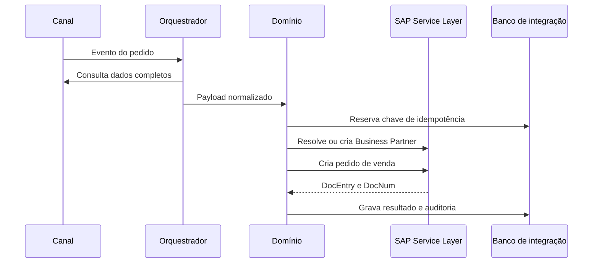
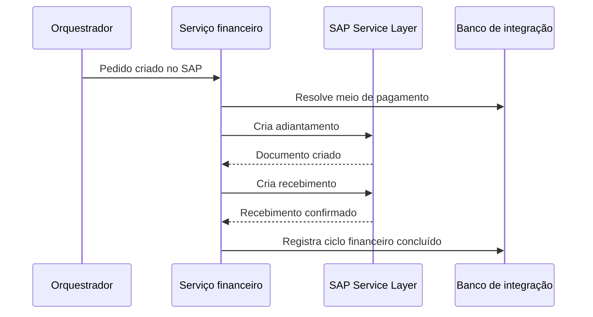

# Arquitetura

## Princípios

A plataforma separa conectores, orquestração, regras de domínio, persistência de controle e integração com o ERP. O objetivo é permitir que novos canais sejam adicionados sem replicar regras críticas do SAP Business One.

## Componentes

| Componente | Responsabilidade |
|---|---|
| Marketplace Connectors | Receber eventos e consultar os dados completos de cada canal |
| Integration Orchestrator | Coordenar etapas, filas, retries, feature flags e reprocessamentos |
| Validation Layer | Validar schema, campos obrigatórios e consistência mínima |
| Domain Services | Aplicar regras de cliente, pedido, pagamento e conciliação |
| SAP Adapter | Gerenciar autenticação, sessão e contratos com o Service Layer |
| Integration Database | Manter estado, idempotência, staging, logs e quarentena |
| Monitoring | Consolidar métricas, logs e alertas operacionais |

## Fluxo comercial

## Fluxo financeiro

## Conciliação

A conciliação é uma fase separada porque a origem do pedido e a origem da liquidação podem ser sistemas diferentes. Os dados externos pousam em staging, passam por normalização e matching e somente exceções exigem ação humana.
